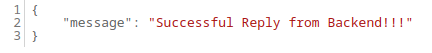

# Le Petit Patissier Project

Welcome to the Le Petite Patisserie project documentation. In this guide, we'll walk you through containerizing and deploying a Django-based backend application and a Django-based frontend application using Docker and Docker Compose.

## Table of Contents

1. [Prerequisits](https://github.com/dayofmythology/patisserie_project#1-prerequisits)
2. [Clone the Project](https://github.com/dayofmythology/patisserie_project/tree/main#2-clone-the-project)
3. [Containerising the Backend Application](https://github.com/dayofmythology/patisserie_project#2-containerising-the-backend-application)
4. [Containerising the Frontend Application](https://github.com/dayofmythology/patisserie_project#3-containerising-the-frontend--application)
5. Running the applications with Docker Compose
6. Deploying to Production
7. Troubleshooting

## 1. Prerequisits
Before you begin, ensure that you have:
- [Git](https://git-scm.com/downloads) installed on your system
- [Docker ](https://docs.docker.com/get-docker/) installed on your system
- [Docker Compose](https://docs.docker.com/compose/install/) installed on your system
- Both apps are based on [Django Framework](https://docs.djangoproject.com/en/4.2/)

## 2. Clone the Project
Clone the project:
```
git clone https://github.com/dayofmythology/patisserie_project.git
```


## 3. Containerising the Backend Application

### 3.1 Navigate to the Backend Project Folder:
Move into the **backend** project folder:
```markdown
cd backend
```
### 3.2 Build a Docker image:

To containerise the backend application, a Dockerfile that will help in building a docker image of the Django based app is located at the root of the **backend Django project**:

[Dockerfile:](https://github.com/dayofmythology/patisserie_backend/blob/main/backend/Dockerfile)

```Dockerfile
FROM python:3.10
# The enviroment variable ensures that the python output is set straight
# to the terminal with out buffering it first
ENV PYTHONUNBUFFERED 1
ENV PYTHONDONTWRITEBYTECODE 1
ENV PORT = 8001

WORKDIR /api

COPY  . /api/

RUN pip install --no-cache-dir -r requirements.txt

CMD [ "python","manage.py","runserver","0.0.0.0:${PORT}" ]
```
To build the image, run the following command:
```
docker build -t backend-api .
```
### 3.3 Test the image:
 - Run the following command:
```markdown
docker run -ti -d -p 8001:8001 --name backend-server backend-api:latest
```
- Open the browser and navigate to http://localhost:8001/api/get_response . You should see the following screen: 

    
    
## 4. Containerising the Frontend  Application
### 4.1 Navigate to the Frontend Project Folder:
Move into the **frontend** project folder:
```markdown
cd frontend
```

### 4.2 Build a Docker image:

To containerise the frontend application, a Dockerfile that will help in building a docker image of the Django based app is located at the root of the **frontend Django project**:

[Dockerfile:](https://github.com/dayofmythology/patisserie_project/blob/main/frontend/Dockerfile)

```Dockerfile
FROM python:3.10
# The enviroment variable ensures that the python output is set straight
# to the terminal with out buffering it first
ENV PYTHONUNBUFFERED 1
ENV PYTHONDONTWRITEBYTECODE 1
ENV PORT = 8001

WORKDIR /api

COPY  . /api/

RUN pip install --no-cache-dir -r requirements.txt

CMD [ "python","manage.py","runserver","0.0.0.0:${PORT}" ]
```
To build the image, run the following command:
```
docker build -t frontend-app .
```
### 4.3 Test the image:
 - Run the following command:
```markdown
docker run -ti -d -p 8000:8000 --name frontend-server frontend-app:latest
```
- Open the browser and navigate to http://localhost:8000 . You should see the following screen: 

    

## 5. Running the applications with Docker Compose
To run the application on docker-compose, run the following command:
```
docker-compose up -d
```
## 6. Deploy to AWS ECS Fargate Production using AWS CodePipeline
The setup of the project as it is now is like this

### 6.1 Build and Push the frontend and backend images to AWS ECR

1. Create a backend and frontend repositories in the ACR
2. The buildspec.yml file will build images for both the backend and frontend and push them to ACR

### 6.2 Set Up AWS CodePipeline:

Sign in to the AWS Management Console.
Open the AWS CodePipeline service.
Click on "Create pipeline."
Provide a name for the pipeline and click "Next."
Source Stage:

1. Sign in to the AWS Management Console.
2. Open the AWS CodePipeline service.
3. third

In the source stage, choose the source code repository (e.g., AWS CodeCommit, GitHub, or Amazon S3) where your application code is stored.
Configure the repository and branch to monitor for changes.
Build Stage (AWS CodeBuild):

Create a build project in AWS CodeBuild.
Configure the build project to build the Docker images and push them to ECR.
Specify build commands and settings in the build project configuration.
Add this CodeBuild project to the pipeline as the build stage.
Deployment Stage (AWS ECS Fargate):

In the pipeline, add a deployment stage.
Choose Amazon ECS as the deployment provider.
Configure the ECS service and task definitions.
Specify the ECR image repository and image details to deploy.
Configure the AWS Fargate launch type and task definition.
IAM Roles:

Ensure that the AWS Identity and Access Management (IAM) roles used by CodePipeline, CodeBuild, and ECS have the necessary permissions to interact with other AWS services.
Test the Pipeline:

Trigger the pipeline manually or allow it to be triggered automatically when changes are pushed to the source repository.
Monitoring:

Set up monitoring and alarms using Amazon CloudWatch to track the pipeline's progress and notify you of any issues.
Security:

Ensure that your AWS resources are properly secured with the appropriate security groups and IAM roles.

## 7. Troubleshooting
- You are running docker-compose in detached mode i.e. `sudo docker compose up -d` and the backend container is failing to start:
  - Make sure
view the logs of the backend service to identify the specific error messages. The command to check the logs is: `sudo docker compose logs backend`
  - Make sure that there's no misconfiguration in the `docker-compose.yml` including syntax errors, missing environment variables, or incorrect volume mappings.
- **Apps are using port 8000 and 8001 by default to accomodate a local run of both images**. If you have changed the ports and happen to be the same, make sure that the ports are not used by other apps/services or containers on the same machine. You can use the **PORT** environment to override the default port value when running a simple test using `docker run` command, or modify it in the docker compose file.
-  If you run the commands shown below, and some volumes are mapped (i.e. mapping a persistent volume) you will see errors in the logs from the backend:
      ```python
      sudo docker compose down
      sudo docker compose up -d
      sudo docker compose stop
      sudo docker compose up
      ```

    This is because the `docker-compose stop` command does not remove the volumes associated with the containers. When you run the up command again, the volumes are still present, but the containers that created them are gone. This can cause errors.

    To fix this problem, you can either remove the volumes manually before running the up command again, or you can use the `--volumes` option to remove the volumes automatically.
