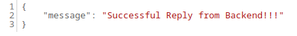
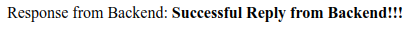

# Le Petit Patissier Project

Welcome to the Le Petite Patisserie project documentation. In this guide, we'll walk you through containerizing and deploying a Django-based backend application and a Django-based frontend application using Docker and Docker Compose.

## Table of Contents

1. [Prerequisits](https://github.com/dayofmythology/patisserie_project#1-prerequisits)
2. [Clone the Project](https://github.com/dayofmythology/patisserie_project/tree/main#2-clone-the-project)
3. [Containerising the Backend Application](https://github.com/dayofmythology/patisserie_project#2-containerising-the-backend-application)
4. [Containerising the Frontend Application](https://github.com/dayofmythology/patisserie_project#3-containerising-the-frontend--application)
5. Pushing the images to Amazon ECR
6. Running the applications with Docker Compose
7. Deploying to Production
8. Troubleshooting

## 1. Prerequisits
Before you begin, ensure that you have:
- [Git](https://git-scm.com/downloads) installed on your system
- [Docker ](https://docs.docker.com/get-docker/) installed on your system
- [Docker Compose](https://docs.docker.com/compose/install/) installed on your system
- Both apps are based on [Django Framework](https://docs.djangoproject.com/en/4.2/)

## 2. Clone the Project
Clone the project:
```
git clone https://github.com/dayofmythology/patisserie_project.git
```


## 3. Containerising the Backend Application

### 3.1 Navigate to the Backend Project Folder:
Move into the **backend** project folder:
```markdown
cd backend
```
### 3.2 Build a Docker image:

To containerise the backend application, a Dockerfile that will help in building a docker image of the Django based app is located at the root of the **backend Django project**:

[Dockerfile:](https://github.com/dayofmythology/patisserie_backend/blob/main/backend/Dockerfile)

```Dockerfile
FROM python:3.10
# The enviroment variable ensures that the python output is set straight
# to the terminal with out buffering it first
ENV PYTHONUNBUFFERED 1
ENV PYTHONDONTWRITEBYTECODE 1
ENV PORT = 8001

WORKDIR /api

COPY  . /api/

RUN pip install --no-cache-dir -r requirements.txt

CMD [ "python","manage.py","runserver","0.0.0.0:${PORT}" ]
```
To build the image, run the following command:
```
docker build -t backend-api .
```
### 3.3 Test the image:
 - Run the following command:
```markdown
docker run -ti -d -p 8001:8001 --name backend-server backend-api:latest
```
- Open the browser and navigate to http://localhost:8001/api/get_response . You should see the following screen: 

    
    
## 4. Containerising the Frontend  Application
### 4.1 Navigate to the Frontend Project Folder:
Move into the **frontend** project folder:
```markdown
cd frontend
```

### 4.2 Build a Docker image:

To containerise the frontend application, a Dockerfile that will help in building a docker image of the Django based app is located at the root of the **frontend Django project**:

[Dockerfile:](https://github.com/dayofmythology/patisserie_project/blob/main/frontend/Dockerfile)

```Dockerfile
FROM python:3.10
# The enviroment variable ensures that the python output is set straight
# to the terminal with out buffering it first
ENV PYTHONUNBUFFERED 1
ENV PYTHONDONTWRITEBYTECODE 1
ENV PORT = 8001

WORKDIR /api

COPY  . /api/

RUN pip install --no-cache-dir -r requirements.txt

CMD [ "python","manage.py","runserver","0.0.0.0:${PORT}" ]
```
To build the image, run the following command:
```
docker build -t frontend-app .
```
### 4.3 Test the image:
 - Run the following command:
```markdown
docker run -ti -d -p 8000:8000 --name frontend-server frontend-app:latest
```
- Open the browser and navigate to http://localhost:8000 . You should see the following screen: 

    

## 5. Push the images to ACR
## 8. Troubleshooting
- You are running docker-compose in detached mode i.e. `sudo docker compose up -d` and the backend container is failing to start:
  - Make sure
view the logs of the backend service to identify the specific error messages. The command to check the logs is: `sudo docker compose logs backend`
  - Make sure that there's no misconfiguration in the `docker-compose.yml` including syntax errors, missing environment variables, or incorrect volume mappings.
- **Apps are using port 8000 and 8001 by default to accomodate a local run of both images**. If you have changed the ports and happen to be the same, make sure that the ports are not used by other apps/services or containers on the same machine. You can use the **PORT** environment to override the default port value when running a simple test using `docker run` command, or modify it in the docker compose file.
